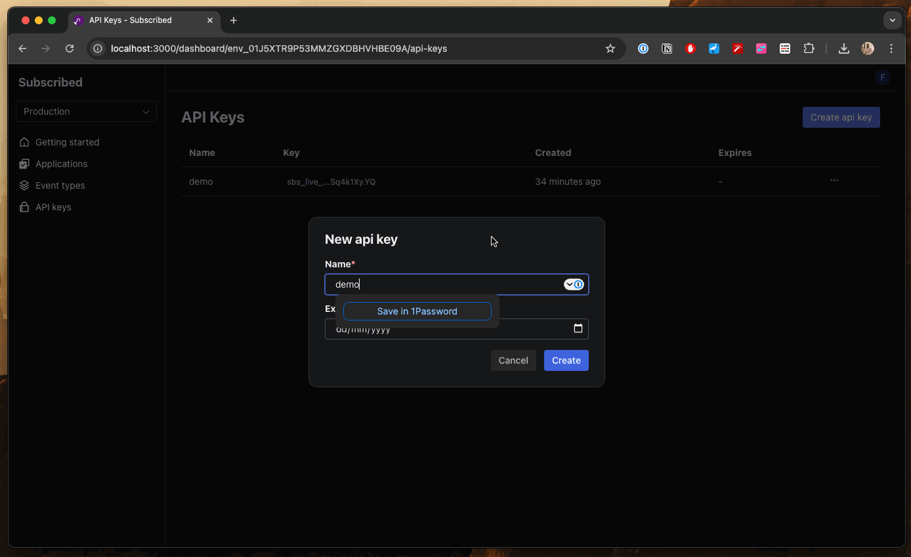

# Subscribed

Subscribed is a webhook provider that allows software developers to quickly add webhook capabilities into their applications, without having to deal with common webhook-related challenges such as:

- Unavailable webhook endpoint
- Network issues
- Retries
- Schema validation

> In early-stage development of a Webhooks provider platform... things will change, a lot.

## License

[GNU Affero General Public License v3.0](./LICENSE)